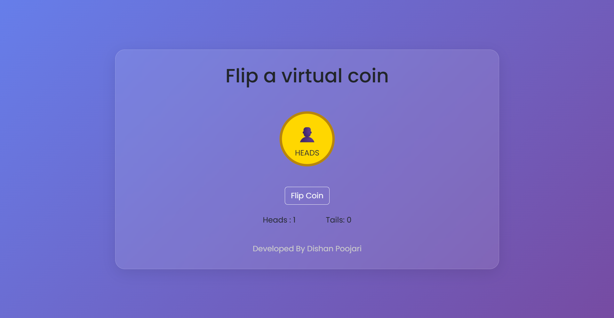

# 🪙 Flip a Coin

A simple and interactive coin flipping application built with vanilla HTML, CSS, and JavaScript. Perfect for making quick decisions or just having fun!

## 🚀 Live Demo

[View Live Project]([your-project-link-here](https://dishan033.github.io/Flip-a-coin/)) <!-- Replace with your actual project URL -->

## 📸 Screenshot

 <!-- Add your project screenshot -->

## 🛠️ Technologies Used

- **HTML5** - Structure and markup
- **CSS3** - Styling and animations
- **JavaScript (ES6)** - Interactive functionality and coin flip logic

## ✨ Features

- 🎯 Simple one-click coin flipping
- 🎨 Smooth animations and transitions
- 📱 Responsive design for all devices
- 🎲 Random outcome generation
- 💫 Visual coin flip animation

## 🎮 How to Use

1. Click the "Flip Coin" button
2. Watch the coin animate as it flips
3. See the result (Heads or Tails)
4. Click "Flip Again" to play another round

## 🏗️ Project Structure

```
flip-a-coin/
│
├── index.html          # Main HTML file
├── styles.css          # CSS styles and animations
├── script.js           # JavaScript functionality
└── README.md           # Project documentation
```

## 🚀 Getting Started

### Prerequisites

- A modern web browser
- Basic understanding of HTML, CSS, and JavaScript (for development)

### Installation

1. Clone the repository:
   ```bash
   git clone https://github.com/yourusername/flip-a-coin.git
   ```

2. Navigate to the project directory:
   ```bash
   cd flip-a-coin
   ```

3. Open `index.html` in your web browser or use a live server extension

## 💻 Code Highlights

- **Pure JavaScript**: No external libraries or frameworks
- **CSS Animations**: Smooth coin flip transitions
- **Responsive Design**: Works on desktop, tablet, and mobile
- **Clean Code**: Well-structured and commented

## 🎯 Learning Objectives

This project demonstrates:

- DOM manipulation with JavaScript
- CSS animations and transforms
- Event handling
- Random number generation
- Responsive web design principles
- Project structure and organization

## 🤝 Contributing

This is a beginner-friendly project! Feel free to:

1. Fork the project
2. Create a feature branch (`git checkout -b feature/AmazingFeature`)
3. Commit your changes (`git commit -m 'Add some AmazingFeature'`)
4. Push to the branch (`git push origin feature/AmazingFeature`)
5. Open a Pull Request

## 📝 License

This project is open source and available under the [MIT License](LICENSE).

## 👨‍💻 Author

**Dishan Poojari**
- GitHub: [dishan033](https://github.com/dishan033)
- LinkedIn: [Dishan Poojari](https://www.linkedin.com/in/dishan-poojari/)

## 🙏 Acknowledgments

- Thanks to the web development community for inspiration
- Built as part of my front-end development journey
  
---

⭐ **If you found this project helpful, please give it a star!** ⭐
